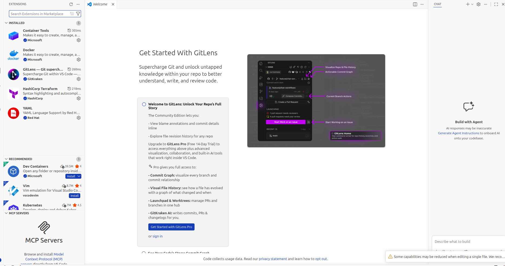
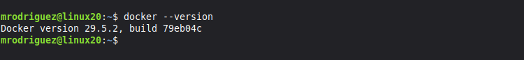
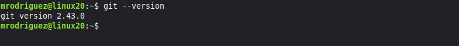
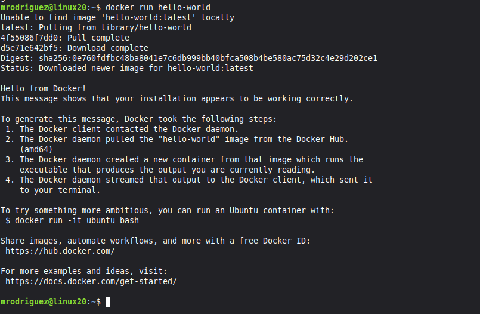
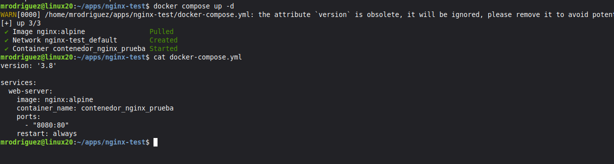

# Reporte: Instalación y Configuración de Herramientas de Automatización de Redes

## Introducción

La evolución de las infraestructuras de telecomunicaciones ha exigido un cambio de paradigma fundamental, pasando de la configuración manual, basada en la interfaz de línea de comandos (CLI) equipo por equipo, a la adopción de metodologías de desarrollo de software aplicadas a las redes. En este contexto, la automatización de la infraestructura digital se presenta no solo como una ventaja competitiva, sino como una necesidad operativa para garantizar la escalabilidad, la consistencia y la reducción de errores humanos en despliegues complejos. El presente informe detalla el procedimiento técnico y metodológico llevado a cabo para la preparación de un entorno de desarrollo profesional, enfocado en la orquestación y el despliegue de servicios.

A lo largo de este documento, se documenta la instalación y configuración de un ecosistema de herramientas fundamentales para la ingeniería moderna. Esto incluye el despliegue de plataformas de contenedorización que permiten empaquetar aplicaciones y sus dependencias en entornos aislados, garantizando que el software se ejecute de manera uniforme independientemente del entorno host. Asimismo, se integran sistemas de control de versiones y entornos de desarrollo integrados (IDE) que facilitan la colaboración, el seguimiento de cambios y la escritura eficiente de código de infraestructura (Infrastructure as Code - IaC). La correcta implementación de este entorno es el primer paso crítico para el diseño, simulación y puesta en producción de arquitecturas de red automatizadas, ágiles y resilientes.

---

## Desarrollo

### Descripción de las herramientas utilizadas para automatización

* **Docker Engine:** Es la tecnología principal de contenedorización de código abierto que permite construir y ejecutar contenedores de forma nativa. Actúa como una plataforma cliente-servidor donde un demonio (daemon) gestiona los objetos de Docker (imágenes, contenedores, redes y volúmenes). En automatización, es vital para aislar controladores de red, scripts de Python o simuladores sin afectar el sistema operativo base.
* **Docker Compose:** Es una herramienta diseñada para definir y ejecutar aplicaciones Docker de múltiples contenedores. Utilizando archivos de configuración en formato YAML (`.yml`), permite levantar entornos de red completos, orquestando la interacción entre distintos servicios, bases de datos o APIs con un solo comando (`docker-compose up`).
* **Docker Swagger:** En el contexto de desarrollo y redes, ejecutar Swagger UI o Swagger Editor a través de un contenedor Docker permite visualizar, interactuar y documentar APIs RESTful (como las utilizadas en RESTCONF para equipos de red) de manera estandarizada y sin necesidad de instalar dependencias locales en el equipo host.

### Procedimiento de instalación

#### Instalación técnica de herramientas necesarias (VSCode, Plugins, etc.)
Para establecer el entorno de escritura de código, se optó por Visual Studio Code debido a su ligereza y soporte de extensiones.
1.  Descarga del paquete de instalación desde la página oficial.
2.  Instalación de extensiones clave para automatización:
    * **Docker:** Para la gestión de contenedores desde la interfaz.
    * **YAML:** Para validación de sintaxis en archivos de configuración.
    * **GitLens:** Para un mejor seguimiento del control de versiones.

#### Instalación técnica de Docker
El proceso en distribuciones basadas en Linux requiere agregar los repositorios oficiales para obtener la versión más reciente del Engine.
1.  Actualización del índice de paquetes: `sudo apt update`.
2.  Instalación de paquetes de requisitos previos para usar repositorios sobre HTTPS.
3.  Adición de la llave GPG oficial de Docker y configuración del repositorio estable.
4.  Instalación del Engine, CLI y containerd: `sudo apt install docker-ce docker-ce-cli containerd.io`.
5.  Adición del usuario local al grupo docker para evitar el uso de `sudo`: `sudo usermod -aG docker $USER`.

#### Instalación técnica de Git
Sistema de control de versiones distribuido fundamental para rastrear los cambios en los scripts de automatización.
1.  Instalación directa desde los repositorios del sistema: `sudo apt install git`.
2.  Configuración inicial de credenciales: 
    * `git config --global user.name "Marcos Daniel Rodriguez Guerrero"`
    * `git config --global user.email "marcosdanielrodriguez097@gmail.com"`

---

### Evidencia de pruebas de verificación de funcionamiento

#### Ejecutar la imagen "hello-world"
Para verificar que el demonio de Docker está funcionando correctamente y es capaz de descargar imágenes desde el Hub oficial, se ejecutó el siguiente comando:
`docker run hello-world`

El resultado muestra la descarga de la imagen y el mensaje de confirmación de que la instalación parece estar funcionando correctamente.

#### Ejecutar un archivo ".YML" para verificar el funcionamiento de contenedores
Se creó un archivo `docker-compose.yml` básico y se levantó el servicio utilizando Docker Compose para validar la orquestación.

---

## Conclusión

**Por: Marcos Daniel Rodriguez Guerrero**

La realización de esta práctica representa un punto de inflexión en la forma en que abordamos la administración de infraestructuras tecnológicas. La transición de configuraciones monolíticas y estáticas hacia entornos ágiles basados en código es fundamental en el panorama actual de las telecomunicaciones. Al instalar y validar herramientas como Docker, Git y Visual Studio Code, logramos consolidar un entorno de desarrollo estandarizado y libre de las inconsistencias típicas del síndrome de "en mi máquina sí funciona". 

El principal hallazgo de esta actividad es comprobar la eficiencia que aporta la contenedorización; desplegar servicios de prueba o documentación mediante Docker Compose y archivos YAML reduce significativamente los tiempos de aprovisionamiento en comparación con la virtualización tradicional. A nivel profesional, dominar este stack tecnológico no es solo un requisito académico, sino el cimiento indispensable para diseñar, simular e implementar topologías de red escalables y seguras, acercándonos a filosofías modernas de trabajo como la Infraestructura como Código (IaC) y la integración continua.

---

## Bibliografía

Docker Inc. (2023). *Docker Documentation: Get Docker*. Recuperado de https://docs.docker.com/get-docker/

Chacon, S., & Straub, B. (2014). *Pro Git* (2nd ed.). Apress. Recuperado de https://git-scm.com/book/en/v2

Microsoft. (2023). *Visual Studio Code Documentation*. Recuperado de https://code.visualstudio.com/docs
